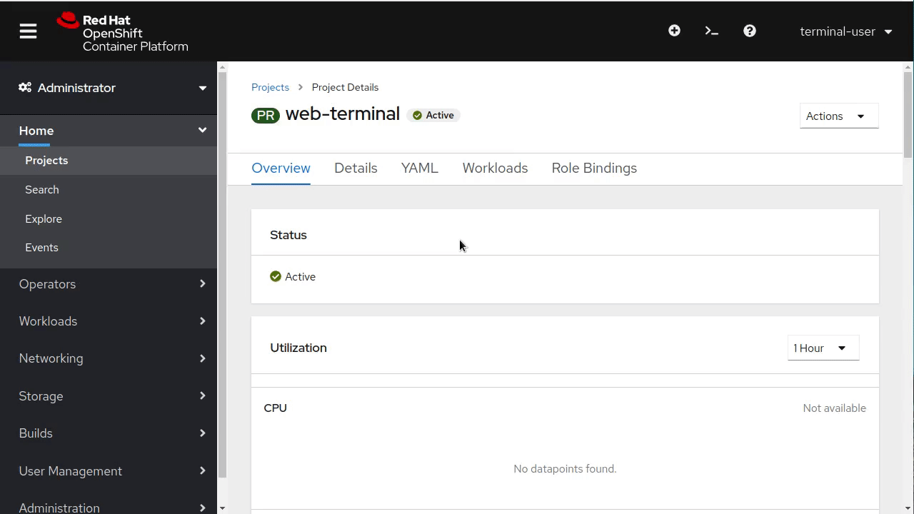

== How to use

After installing the Web Terminal operator, you can use the web terminal by first clicking on the terminal button in the top right of the OpenShift console

This will open up a web terminal at the bottom of your screen. This terminal will automatically be logged in as your OpenShift user and have tools like oc, kubectl, odo, kn, tkn, helm, kubens, and kubectx pre-installed. 

